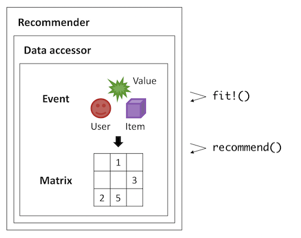

# Recommendation.jl


[](https://takuti.github.io/Recommendation.jl/latest/)

**Recommendation.jl** is a minimal, customizable Julia package for building recommender systems. Pre-built basic functionalities include:

- Non-personalized baselines that give unsophisticated, rule-based recommendation.
- Collaborative filtering on either explicit or implicit user-item matrix.
- Model-based factorization approaches such as Singular Value Decomposition (SVD), Matrix Factorization (MF), and Factorization Machines (FMs).
- Content-based filtering by using the TF-IDF weighting technique.
- Evaluation based on a variety of rating and ranking metrics, with easy-to-use N-fold cross validation executor.

## Installation

```julia
julia> using Pkg; Pkg.add("Recommendation")
```

## Usage

This package contains a unified `DataAccessor` module and several non-personalized/personalized recommenders, as well as evaluation metrics such as `Recall`:



See [Getting Started](https://takuti.github.io/Recommendation.jl/latest/getting_started/) in [documentation](https://takuti.github.io/Recommendation.jl/latest/) for the details.

## Development

Change the code and test locally:

```julia
julia> using Pkg; Pkg.activate(@__DIR__); Pkg.instantiate()
julia> Pkg.test("Recommendation")
```

Note that unit tests for dataset loaders (e.g., `load_movielens_latest()`) are conditionally triggered as follows, so that CI does not make excessive download requests to the external sites:

```julia
julia> Pkg.test("Recommendation", test_args=["data", "download"])
```

Build documentation contents:

```
$ julia --project=docs -e 'using Pkg; Pkg.develop(PackageSpec(path=pwd())); Pkg.instantiate()'
$ julia --project=docs docs/make.jl
$ open docs/build/index.html
```

Follow [JuliaRegistries/Registrator.jl](https://github.com/JuliaRegistries/Registrator.jl) for releasing.
